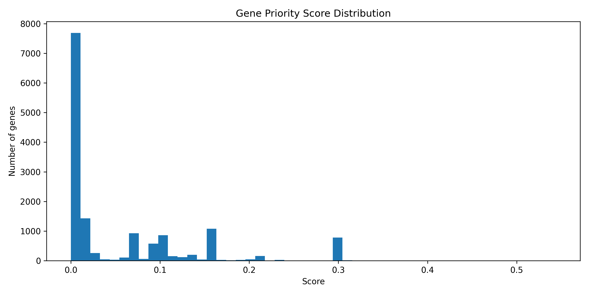
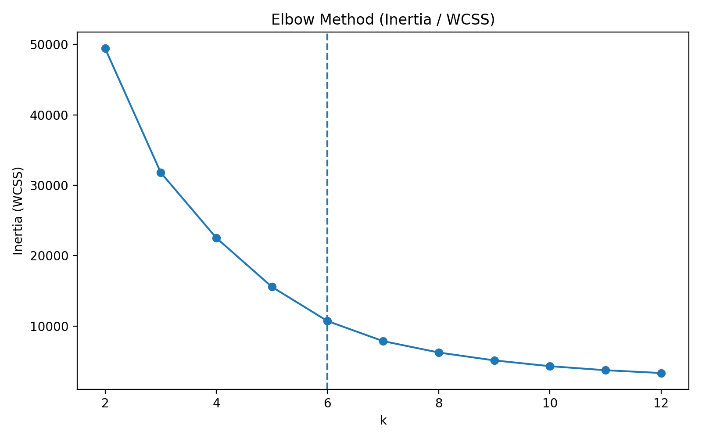
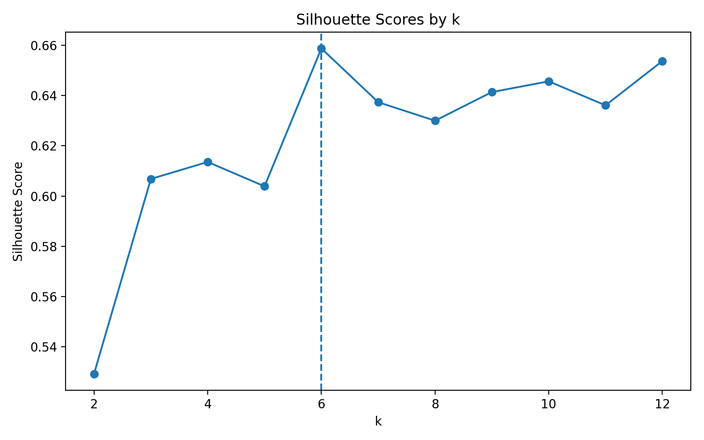
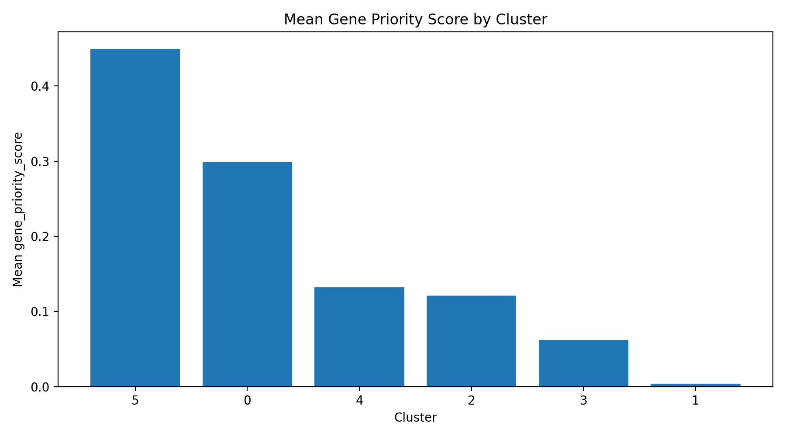
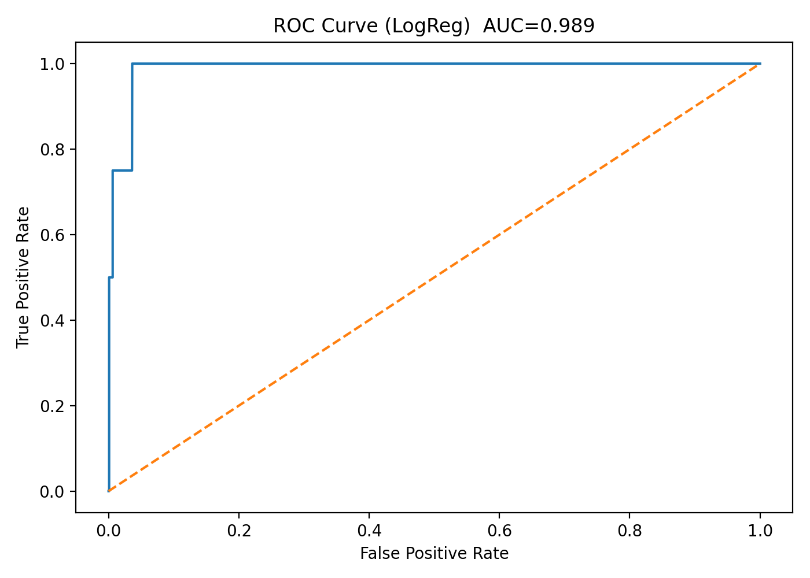
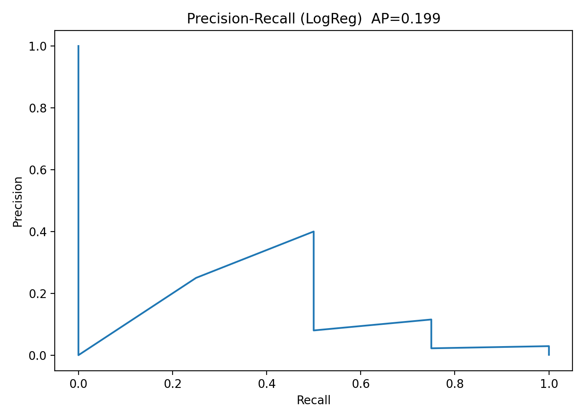

# 🧬 TCGA-LIHC Somatik Mutasyon Verileri Kullanılarak  
# Gen Önceliklendirme ve Makine Öğrenmesi Tabanlı Analiz

## 📌 Proje Özeti
Bu projede, **TCGA-LIHC (Hepatoselüler Karsinom)** somatik mutasyon verileri kullanılarak, genlerin mutasyon özelliklerine dayalı bir **gen önceliklendirme (gene prioritization)** yaklaşımı geliştirilmiştir.

Amaç; çok sayıda mutasyon içeren büyük genomik veri setleri içerisinde, **kanserle ilişkili sürücü (driver) genleri** daha anlamlı biçimde öne çıkarabilecek **yorumlanabilir skorlar ve makine öğrenmesi tabanlı yöntemler** kullanmaktır.

Proje; ham MAF dosyalarından başlayarak, özellik çıkarımı, skor üretimi, kümeleme (unsupervised learning) ve zayıf denetimli (weak-supervised) makine öğrenmesi adımlarını içeren **çok aşamalı bir analiz hattı** şeklinde tasarlanmıştır.

---

## 🎯 Projenin Amacı
- TCGA-LIHC somatik mutasyon verilerini analiz etmek  
- Gen bazlı mutasyon özellikleri çıkarmak  
- Mutasyon sıklığı, etki şiddeti ve hasta yaygınlığına dayalı **gen öncelik skoru** geliştirmek  
- Benzer mutasyon profiline sahip genleri **kümelemek**  
- Bilinen driver genlerden yararlanarak **driver-benzeri genleri** makine öğrenmesi ile tahmin etmek  

---

## 🧪 Kullanılan Veri Seti
- **Kaynak:** TCGA (The Cancer Genome Atlas)  
- **Kanser Türü:** Liver Hepatocellular Carcinoma (LIHC)  
- **Veri Türü:** Somatic Mutation (MAF)  
- **Hasta Sayısı:** 414  
- **Toplam Mutasyon:** ~48.000  
- **Toplam Gen:** ~14.600  

---

## 🔬 Metodoloji (Adım Adım)

### 🔹 Adım 1 — MAF Dosyalarının Birleştirilmesi
TCGA-LIHC için indirilen çok sayıda `.maf.gz` dosyası tek bir tablo altında birleştirilmiştir.

- Çıktı: `merged_LIHC_MAF.csv`  
- Her satır: tek bir somatik mutasyon  

---

### 🔹 Adım 2 — Gen Bazlı Özellik Çıkarımı
Birleştirilen MAF dosyasından gen seviyesinde özet özellikler üretilmiştir:

- Toplam mutasyon sayısı (`n_mutations`)  
- Mutasyon görülen hasta sayısı (`n_patients`)  
- Hasta frekansı (`patient_frequency`)  
- Yüksek etki oranı (`high_impact_ratio`)  
- Hotspot mutasyon oranı (`hotspot_ratio`)  

- Çıktı: `gene_feature_table.csv`

---

### 🔹 Adım 2 (Devam) — Gen Öncelik Skoru
Genlerin mutasyon profillerine dayalı **ağırlıklı bir skor** hesaplanmıştır:

- Hasta yaygınlığı (en yüksek ağırlık)  
- Yüksek etki oranı  
- Hotspot oranı  

- Çıktı: `gene_priority_score.csv`

#### 📊 Top 20 Gen Öncelik Skoru


#### 📊 Skor Dağılımı


## 🔹 Adım 3A — Biyolojik Tutarlılık Kontrolü

Elde edilen skorlar, LIHC için literatürde bilinen **driver genler** ile karşılaştırılmıştır.

- **TP53**, **CTNNB1**, **ARID1A**, **AXIN1** gibi genlerin üst sıralarda yer aldığı gözlemlenmiştir.
- Bu sonuç, skorun **biyolojik olarak anlamlı** olduğunu göstermektedir.

---

## 🔹 Adım 3B — Kümeleme (Unsupervised Learning)

Genler, mutasyon özelliklerine göre **KMeans** algoritması ile kümelenmiştir.

**K seçimi için:**
- **Elbow (Inertia)**
- **Silhouette analizi**

Amaç: Benzer mutasyon profiline sahip genleri gruplamak.

### 📊 Elbow Yöntemi

Dosya yolu: `outputs/step3b_elbow_inertia.png`



### 📊 Silhouette Skorları

Dosya yolu: `outputs/step3b_silhouette_scores.png`



---

## 🔹 Adım 3C — Küme Yorumlama

Her küme:

- Ortalama mutasyon profiline göre özetlenmiş,
- **“Driver-benzeri”**, **“yüksek mutasyonlu”**, **“yüksek etkili ama nadir”** gibi anlamlı etiketlerle yorumlanmıştır.

### 📊 Kümelere Göre Ortalama Skor

Dosya yolu: `outputs/step3c_score_by_cluster.png`



---

## 🔹 Adım 3D — Makine Öğrenmesi ile Driver-Benzeri Skor

Bilinen LIHC driver genleri kullanılarak **weak-supervised learning** yaklaşımı uygulanmıştır.

**Kullanılan modeller:**
- Logistic Regression
- Random Forest

**Çıktılar:**
- `ml_driver_probability`
- Hibrit skor (klasik skor + ML)

### 📊 ROC ve Precision–Recall Eğrileri

Dosya yolları:  
- `outputs/step3d_roc_curve.png`  
- `outputs/step3d_pr_curve.png`





---

## 📁 Depo (Repository) Yapısı

```text
GDC_TCGA_LIHC/
│
├─ data/
├─ outputs/
├─ step1_merge_maf.py
├─ step2_gene_priority_score.py
├─ step3A_validate_and_report.py
├─ step3B_clustering.py
├─ step3C_cluster_interpretation.py
├─ step3D_ml_driver_like_score.py
└─ README.md

## 📌 Bulgular

- TCGA-LIHC somatik mutasyon verileri kullanılarak yaklaşık **14.600 gen** için gen bazlı mutasyon profilleri başarıyla çıkarılmıştır.
- Geliştirilen **gen öncelik skoru**, LIHC ile ilişkili **bilinen sürücü (driver) genleri** (TP53, CTNNB1, ARID1A, AXIN1 vb.) üst sıralarda konumlandırmıştır.
- Unsupervised makine öğrenmesi (KMeans) ile genler, mutasyon özelliklerine göre **anlamlı kümelere** ayrılmıştır.
- Kümeleme sonuçları, **yük driver-benzeri**, **yüksek mutasyonlu (gen uzunluğu etkisi olası)** ve **nadir fakat yüksek etkili** gen gruplarını ayırt edebilmiştir.
- Weak-supervised makine öğrenmesi yaklaşımı ile her gen için **driver-benzeri olasılık (ml_driver_probability)** hesaplanmıştır.
- Klasik gen öncelik skoru ile makine öğrenmesi çıktılarının birleştirilmesi sonucunda, **driver adaylarının daha tutarlı biçimde öne çıkarıldığı** gözlemlenmiştir.
- Elde edilen sonuçlar, mutasyon temelli gen önceliklendirme yaklaşımının **biyolojik olarak anlamlı ve genişletilebilir** olduğunu göstermektedir.
