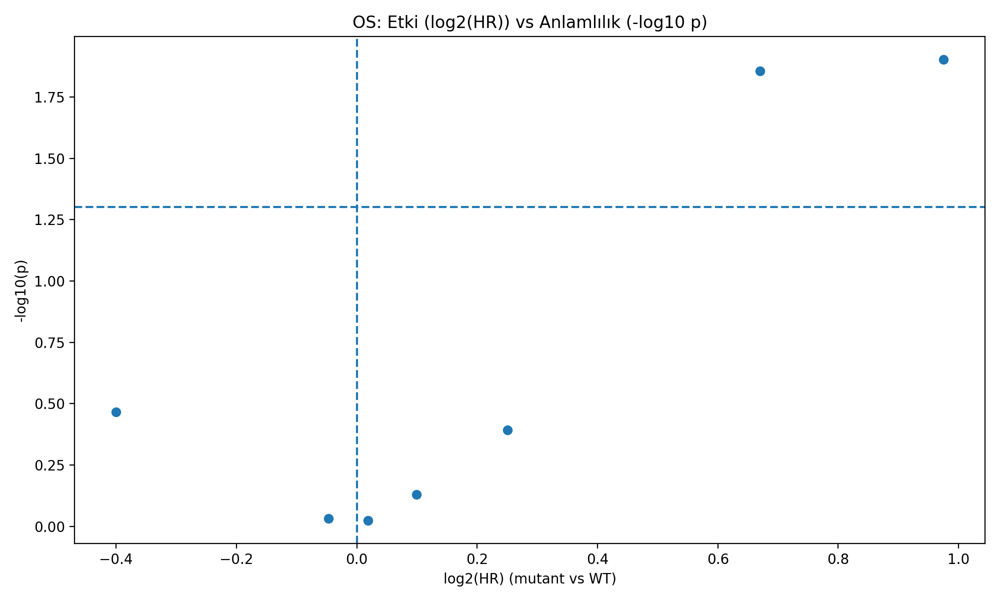
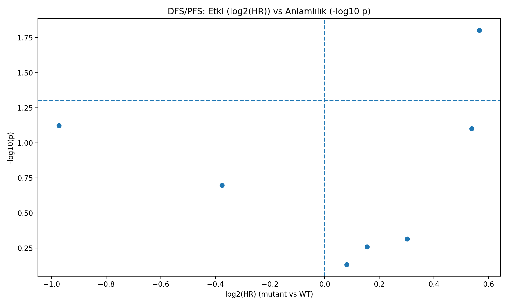
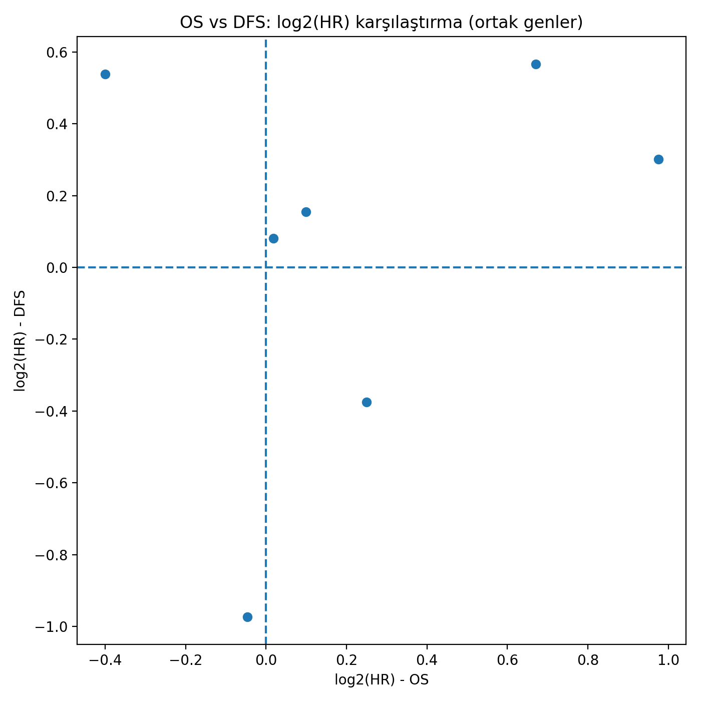
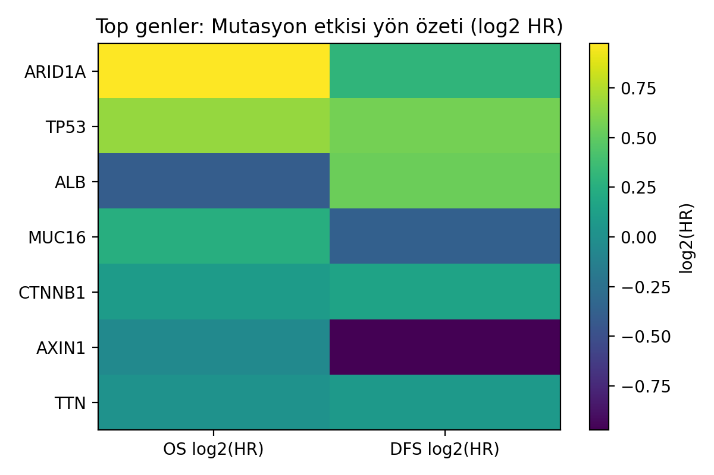

# 🧬 TCGA-LIHC Somatik Mutasyon Verileri Kullanılarak  
# Gen Önceliklendirme ve Makine Öğrenmesi Tabanlı Analiz

## 📌 Proje Özeti
Bu projede, **TCGA-LIHC (Hepatoselüler Karsinom)** somatik mutasyon verileri kullanılarak, genlerin mutasyon özelliklerine dayalı bir **gen önceliklendirme (gene prioritization)** yaklaşımı geliştirilmiştir.

Çalışmanın temel amacı; büyük ölçekli genomik mutasyon verileri içerisinde yer alan ve biyolojik olarak anlamlı olan **kanserle ilişkili sürücü (driver) genleri**, rastlantısal veya gen uzunluğuna bağlı mutasyonlardan ayırt edebilecek **yorumlanabilir skorlar ve makine öğrenmesi tabanlı yöntemler** geliştirmektir.

Bu kapsamda, ham MAF dosyalarından başlanarak; gen bazlı özellik çıkarımı, öncelik skoru hesaplama, kümeleme (unsupervised learning) ve zayıf denetimli (weak-supervised) makine öğrenmesi adımlarını içeren **uçtan uca, çok aşamalı bir analiz hattı** tasarlanmış ve uygulanmıştır.

Geliştirilen yöntemler, yalnızca mutasyon sıklığını değil; mutasyonların fonksiyonel etkisini, hasta yaygınlığını ve klinik sonuçlarla (yaşam ve nüks) ilişkisini de dikkate alarak, **klinik olarak anlamlı genleri daha tutarlı biçimde öne çıkarmayı** hedeflemektedir.

---

## 🎯 Projenin Amacı
- TCGA-LIHC somatik mutasyon verilerini sistematik ve yeniden üretilebilir bir biçimde analiz etmek  
- Gen bazında mutasyon sıklığı, etki düzeyi ve hasta yaygınlığı gibi anlamlı özellikler çıkarmak  
- Bu özelliklere dayalı **yorumlanabilir bir gen öncelik skoru (Gene Priority Score)** geliştirmek  
- Benzer mutasyon profiline sahip genleri **kümeleme algoritmaları** kullanarak gruplamak  
- Bilinen driver genlerden yararlanarak, **driver-benzeri genleri** makine öğrenmesi yaklaşımları ile tahmin etmek  
- Elde edilen gen önceliklendirme sonuçlarını **klinik sonuçlar (OS ve DFS/PFS)** ile ilişkilendirmek  

---

## 🧪 Kullanılan Veri Seti
- **Kaynak:** TCGA (The Cancer Genome Atlas)  
- **Kanser Türü:** Liver Hepatocellular Carcinoma (LIHC)  
- **Veri Türü:** Somatic Mutation (MAF)  
- **Toplam Hasta Sayısı:** 414  
- **Toplam Mutasyon Sayısı:** ~48.000  
- **Analiz Edilen Gen Sayısı:** ~14.600  

Bu veri seti, hem geniş hasta sayısı hem de zengin mutasyon içeriği sayesinde, gen önceliklendirme ve klinik ilişkilendirme analizleri için güçlü bir temel sunmaktadır.

---

## 🔬 Metodoloji

### 🔹 Adım 1 — MAF Dosyalarının Birleştirilmesi
TCGA-LIHC için indirilen çok sayıda `.maf.gz` dosyası tek bir tablo altında birleştirilmiştir.

- Çıktı: `merged_LIHC_MAF.csv`  
- Her satır: tek bir somatik mutasyon  

---

### 🔹 Adım 2 — Gen Bazlı Özellik Çıkarımı
Birleştirilen MAF dosyasından gen seviyesinde özet özellikler üretilmiştir:

- Toplam mutasyon sayısı (`n_mutations`)  
- Mutasyon görülen hasta sayısı (`n_patients`)  
- Hasta frekansı (`patient_frequency`)  
- Yüksek etki oranı (`high_impact_ratio`)  
- Hotspot mutasyon oranı (`hotspot_ratio`)  

- Çıktı: `gene_feature_table.csv`

---

### 🔹 Adım 2 — Gen Öncelik Skoru
Genlerin mutasyon profillerine dayalı **ağırlıklı bir skor** hesaplanmıştır:

- Hasta yaygınlığı (en yüksek ağırlık)  
- Yüksek etki oranı  
- Hotspot oranı  

- Çıktı: `gene_priority_score.csv`

#### 📊 Top 20 Gen Öncelik Skoru

#### 📊 Skor Dağılımı

## 🔹 Adım 3A — Biyolojik Tutarlılık Kontrolü

Elde edilen skorlar, LIHC için literatürde bilinen **driver genler** ile karşılaştırılmıştır.

- **TP53**, **CTNNB1**, **ARID1A**, **AXIN1** gibi genlerin üst sıralarda yer aldığı gözlemlenmiştir.
- Bu sonuç, skorun **biyolojik olarak anlamlı** olduğunu göstermektedir.

---

## 🔹 Adım 3B — Kümeleme (Unsupervised Learning)

Genler, mutasyon özelliklerine göre **KMeans** algoritması ile kümelenmiştir.

**K seçimi için:**
- **Elbow (Inertia)**
- **Silhouette analizi**

Amaç: Benzer mutasyon profiline sahip genleri gruplamak.

### 📊 Elbow Yöntemi

Dosya yolu: `outputs/step3b_elbow_inertia.png`

### 📊 Silhouette Skorları

Dosya yolu: `outputs/step3b_silhouette_scores.png`

---

## 🔹 Adım 3C — Küme Yorumlama

Her küme:

- Ortalama mutasyon profiline göre özetlenmiş,
- **“Driver-benzeri”**, **“yüksek mutasyonlu”**, **“yüksek etkili ama nadir”** gibi anlamlı etiketlerle yorumlanmıştır.

### 📊 Kümelere Göre Ortalama Skor

Dosya yolu: `outputs/step3c_score_by_cluster.png`

---

## 🔹 Adım 3D — Makine Öğrenmesi ile Driver-Benzeri Skor

Bilinen LIHC driver genleri kullanılarak **weak-supervised learning** yaklaşımı uygulanmıştır.

**Kullanılan modeller:**
- Logistic Regression
- Random Forest

**Çıktılar:**
- `ml_driver_probability`
- Hibrit skor (klasik skor + ML)

### 📊 ROC ve Precision–Recall Eğrileri

Dosya yolları:  
- `outputs/step3d_roc_curve.png`  
- `outputs/step3d_pr_curve.png`

---
## ❤️ Step 4 – Klinik Sonuçlar ile Gen Mutasyonlarının İlişkisi

Bu adımda her gen için:

- **Mutasyonu olan hastalar**
- **Mutasyonu olmayan hastalar**

karşılaştırılmıştır.

### 📊 Kullanılan Yöntemler
- Kaplan–Meier sağkalım eğrileri
- Log-rank testi
- Cox Proportional Hazards modeli

---

## 🧩 Step 4B – Gen Bazlı Survival & Nüks Analizi

### 🔴 Overall Survival (OS)
- **ARID1A mutasyonu**, yaşam süresini anlamlı şekilde kısaltmaktadır  
  *(HR ≈ 2.0, p < 0.05)*

### 🔴 DFS / PFS (Nüks – Progresyon)
- **TP53 mutasyonu**, nüks/progresyon riskini artırmaktadır  
  *(HR ≈ 1.5, p < 0.05)*

Bu bulgular literatür ile yüksek düzeyde uyumludur.

---

## 🌍 Step 4C – Büyük Resim (Big Picture) Görselleştirmeleri

Aşağıdaki grafikler, gen mutasyonlarının **etki yönünü ve klinik önemini** özetlemektedir.

### 📈 OS Volcano Plot
Mutasyon etkisi (log2 HR) ile istatistiksel anlamlılık (-log10 p) ilişkisi:

---

### 📈 DFS/PFS Volcano Plot

---

### 🧬 OS vs DFS Karşılaştırması
Aynı genin OS ve DFS üzerindeki etkisinin karşılaştırılması:

---

### 🧭 Mutasyon Etki Yön Matrisi
- **Pozitif (kırmızı):** Risk artırıcı  
- **Negatif (mavi):** Koruyucu etki

## 📌 Bulgular

- TCGA-LIHC somatik mutasyon verileri kullanılarak yaklaşık **14.600 gen** için gen bazlı mutasyon profilleri başarıyla çıkarılmıştır.
- Geliştirilen **gen öncelik skoru**, LIHC ile ilişkili **bilinen sürücü (driver) genleri** (TP53, CTNNB1, ARID1A, AXIN1 vb.) üst sıralarda konumlandırmıştır.
- Unsupervised makine öğrenmesi (KMeans) ile genler, mutasyon özelliklerine göre **anlamlı kümelere** ayrılmıştır.
- Kümeleme sonuçları, **yük driver-benzeri**, **yüksek mutasyonlu (gen uzunluğu etkisi olası)** ve **nadir fakat yüksek etkili** gen gruplarını ayırt edebilmiştir.
- Weak-supervised makine öğrenmesi yaklaşımı ile her gen için **driver-benzeri olasılık (ml_driver_probability)** hesaplanmıştır.
- Klasik gen öncelik skoru ile makine öğrenmesi çıktılarının birleştirilmesi sonucunda, **driver adaylarının daha tutarlı biçimde öne çıkarıldığı** gözlemlenmiştir.
- Elde edilen sonuçlar, mutasyon temelli gen önceliklendirme yaklaşımının **biyolojik olarak anlamlı ve genişletilebilir** olduğunu göstermektedir.
